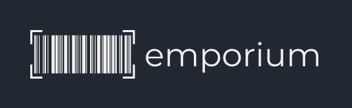

<div style="display:flex;justify-content:center">
    
</div>

---

#### Emporium API

This repo is an Emporium API created for a POS web application called emporium. To use this API, you can follow the steps below.

> You must create .env file that contains secret configuration.

```bash
PORT=
MONGODB_URI=
DB_NAME=
JWT_KEY=
```

After that you can install the modules. (you can use npm, yarn or whatever here i am using pnpm)

```bash
pnpm install
pnpm run dev
```

Or you want to test the API, you can use the following command.

```bash
pnpm run test
```
